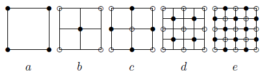
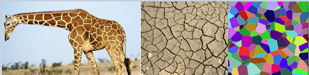
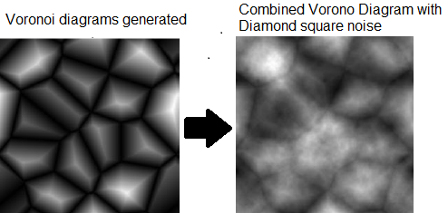

# Terrain-Generation

<h3>Introduction</h3>
	
Terrain generation in this demo is achieved by converting noise into a height map. There are many ways of creating noise which could be generated from a bitmap or an algorithm. In this demo noise is created with the use of a common technique used to create a basic terrain which is the 1/f noise (“pink noise”). To create the noise Midpoint Displacement is used, which is also known as a diamond square algorithm.Since the 1/f noise is too isotropic, we can incorporate the Voronoi diagrams to give the terrain a more realistic look.
 

<h3>Diamond Square algorithm</h3>
	
This algorithm is essentially a way of generating 1/f noise by a midpoint displacement method. This algorithm recursively goes through two steps, diamond step and a square step, hence the name. For example, to start with a two dimensional array, the four corners of the array must be initially set and all the other values are to be calculated. In the diamond step take the average of the four corners plus a random offset value and place it in the center of the diamond. Then in the square step take the average of all corners plus a random offset and place it in the center of the square.

<h3>Voronoi Diagrams</h3>
	
The problem with using 1/f noise to generate terrain is that it is too isotropic, which doesn’t simulate realistic terrain. Voronoi pattern is a partition of a plane into regions close to each of a given set of objects. Examples of voronoi pattern:

The implementation works by generating random points in our map. These random points will have a set distance ratio, the higher the ratio the bigger each voronoi cell.

<h3>Note:</h3> 
glm is not included in this project, to run you must link glm to the project solution.
 
